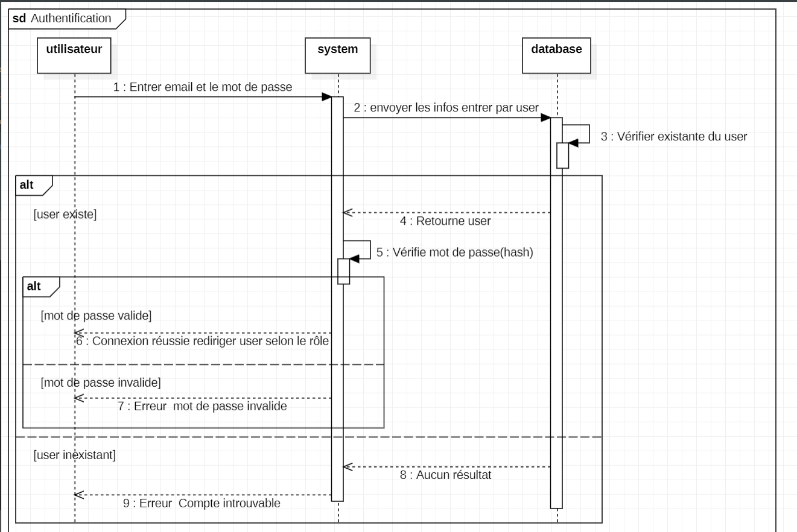
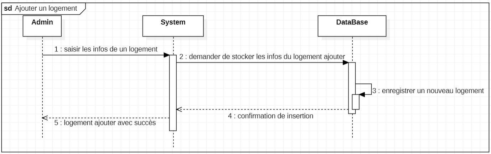
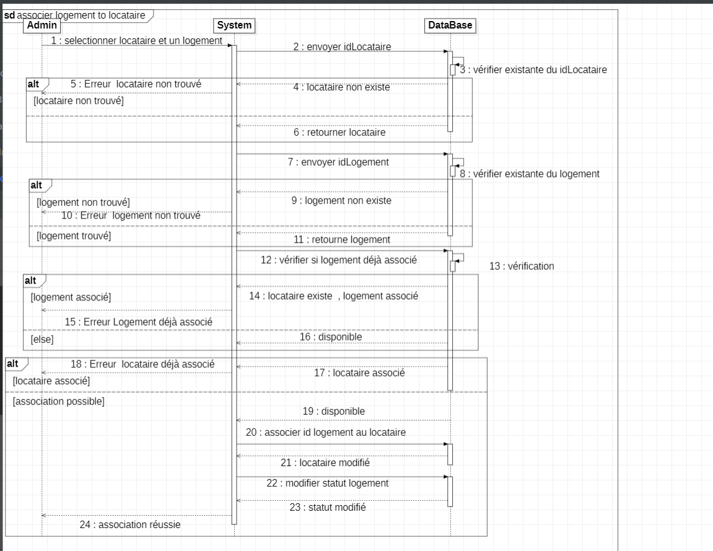
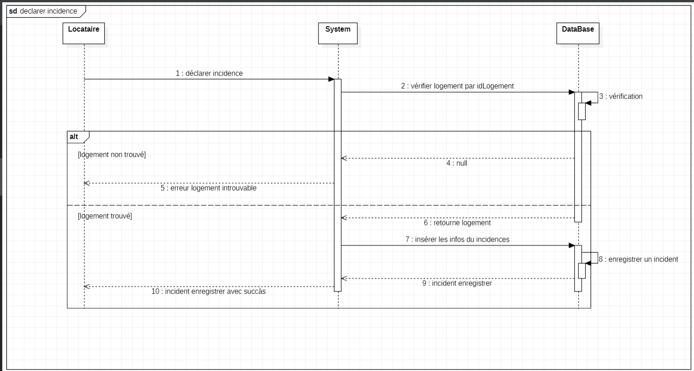

**ImmoGestion – Application de Gestion Immobilière**

ImmoGestion est une application web développée avec Angular 19 (front-end) et Spring Boot  (back-end), connectée à une base de données MySQL.
Elle permet aux administrateurs et locataires de gérer efficacement la location immobilière et toutes les opérations associées.

**✨ Fonctionnalités principales**

🔐 Authentification & Autorisation (Admin / Locataire / Employe)

🏘️ Gestion des logements : ajout, modification, suppression et affichage

👥 Gestion des locataires : association d’un locataire à un logement

💳 Paiements & Charges : suivi des loyers et dépenses liées aux biens

👨‍🔧 Gestion du personnel (agents, techniciens, etc.)

📝 Déclaration d’incidents par les locataires et suivi par l’administrateur

**🛠️ Stack Technique**

Front-end : Angular 19, Tailwind CSS

Back-end : Spring Boot 3, Spring Security, JPA/Hibernate

Base de données : PostgreSQL ou MySQL

Outils : Maven, Git, Postman, UML (diagrammes de séquence, cas d’utilisation, classes)

🎯 Objectif

Offrir une solution simple et intuitive pour :

Centraliser la gestion immobilière,

Améliorer la communication entre propriétaires, locataires et administrateurs,

Automatiser la gestion des paiements et des incidents.
 

   

**Conception UML**

**use case diagram**

**class diagram**

**sequence diagram**

Authentifier

Ajouter logement

Associer logement to locataire

Declarer incident

